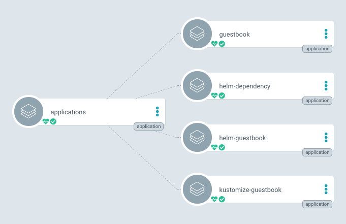

# Overview

## What Is Argo CD?

Argo CD is a declarative, GitOps continuous delivery tool for Kubernetes.

## How it works

Argo CD follows the GitOps pattern of using Git repositories as the source of truth for defining the desired application state. Kubernetes manifests can be specified in several ways and in our case we are using Helm.

Argo CD automates the deployment of the desired application states in the specified target environments. Application deployments can track updates to branches, tags, or pinned to a specific version of manifests at a Git commit.

## Architecture

## Tracking and Deployment Strategies

- Use the latest (e.g. in local development)
- Tag Tracking (e.g. staging, qa...)
- Commit Pinning for production only.

## Cluster Bootstrapping

The most of prefered way is app of apps pattern. We define a root ArgoCD Application (Root App) which contains the ArgoCD Application for each child apps.

