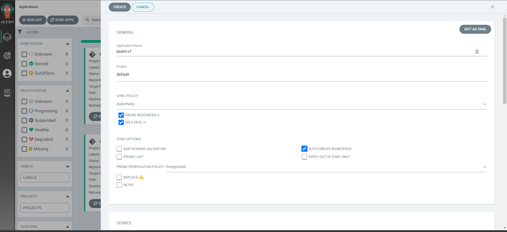
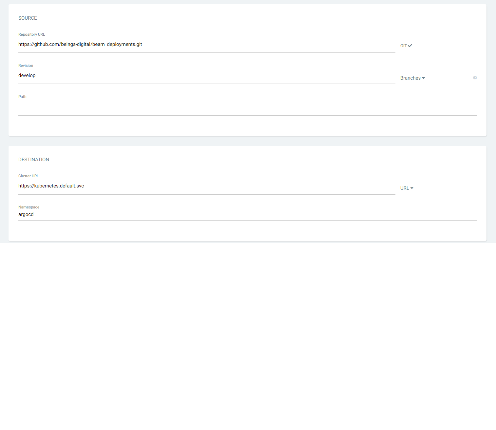

# Create deployment for new enviroment

We are using branch per enviroment approach. Can switch to enviroment per folder for better ogranised.

## Create new branch for new enviroment

Branching off new brach from develop for new enviroment.

```
git checkout develop
git branch -b v1
```

## Configure new variables

Copy the `values.yaml` to new file with format `values.<env>.yaml` and edit the value for new env

```
cp values.yaml values.v1.yaml
```

## Create new ArgoCD application

Go to Argocd dashboard and create new application for new environment.

Configure application name, project, etc...



Configure source and destination



NOTE: destination must be `argocd` as ArgoCD monitors the application on `argocd` namespace only.

Then choose the override enviroment file we created `values.v1.yaml`


# Continuous Deployment

To deploy changes to we need to configure a github action on development repository `https://github.com/beings-digital/Beam` which is using build new container images and deploy changes by pushing a commit to enviroment branch on this repo such as `v1`.